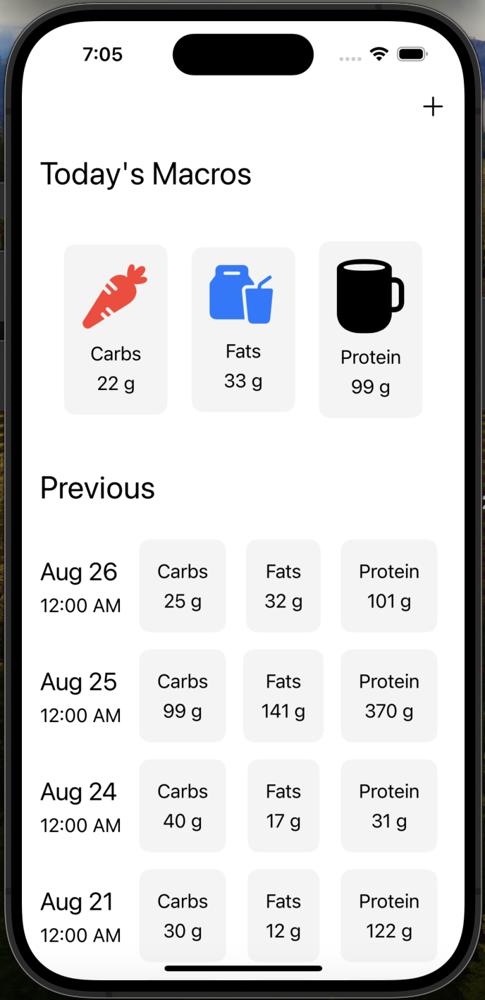
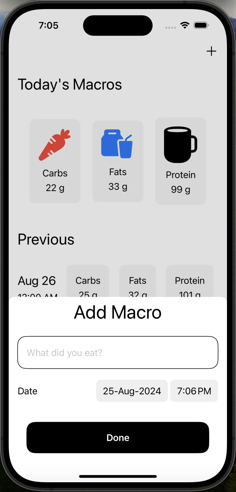
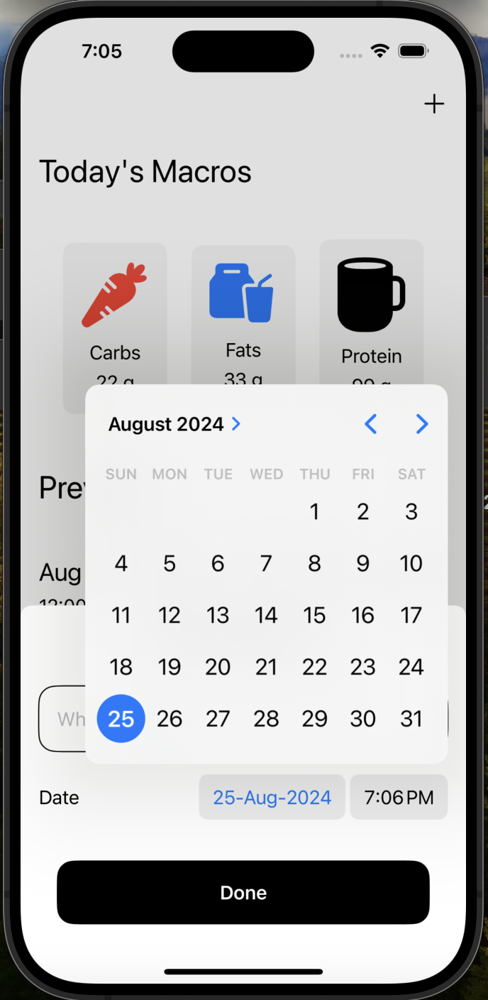

# Nutrition Tracker App

## Overview
Nutrition Tracker App is an iOS application designed to help users keep track of their daily nutrition intake. The app allows users to log the food they eat, and with the help of GPT's function calling, it calculates and stores the macro nutrients present in the food.

A companion watchOS app is also in development, providing users with seamless tracking on their Apple Watch.

## Features
- **Daily Nutrition Tracking:** Log your meals and track your daily nutrition intake.
- **GPT Integration:** Utilize GPT's function calling to automatically calculate macro nutrients based on the name and quantity of the food you ate.
- **Data Storage:** All nutrition data is stored securely using SwiftData.
- **User-Friendly Interface:** Simple and intuitive UI for easy navigation and tracking.

## Screenshots
</img>
*Main Page - Overview of your daily nutrition intake.*

</img>
*Add Food - Enter the food you ate and its quantity.*

</img>
*Add Date - Log the date for your food entry.*

## Installation
1. Clone the repository:
    ```bash
    git clone  https://github.com/krishna-p060/Nutrition-Tracker-AI-App.git
    ```

2. Open the project in Xcode:
    ```bash
    open MacroTrackerApp.xcodeproj
    ```

3. Build and run the app on your iOS device or simulator.

## Usage
1. Open the app.
2. On the main page, view your daily nutrition summary.
3. Click "PLus icon" to enter a new food item.
4. The app will automatically calculate and display the macro nutrients.
5. Save the entry, and the data will be stored using SwiftData.

## Technologies Used
- **iOS Development:** Swift, SwiftUI
- **Data Storage:** SwiftData
- **AI Integration:** GPT's function calling for macro nutrient calculation
- **Version Control:** Git, GitHub

## Future Work
- **Companion watchOS App:** Continued development for seamless integration with the iOS app. Users will be able to enter the food they ate from their watch directly which after calculations will be stored in iOS app.
